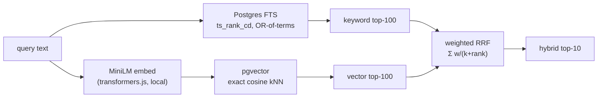

# hybrid-search-engine

Hybrid keyword + semantic search over Postgres, built around one hard problem:
**fusing a keyword relevance score and an embedding similarity into a single
ranking when the two scores live on completely different, incomparable scales.**
Day 4 of a 30-day build challenge — a vertical slice, not a product.

Node + TypeScript · PostgreSQL (full-text search + pgvector) · Vitest.

---

## The hard problem

Two retrievers, two incompatible number lines:

- **Keyword** — Postgres `ts_rank_cd` produces scores like `0.2`, `4.0`, `19.2`
  (term frequency × proximity; unbounded-ish, and larger for long matches).
- **Vector** — pgvector cosine similarity is bounded in `[0, 1]`, typically
  `0.4`–`0.65`.

You cannot just add them. Add `ts_rank + cosine` and the keyword score's
magnitude (up to ~20) drowns the cosine score (max 1) — the "fusion" is really
just keyword search with rounding error. Normalizing helps but is fiddly and
outlier-sensitive.

**The fix used here is Reciprocal Rank Fusion (RRF):** throw the raw scores away
and fuse by **rank**.

```
score(d) = Σ_lists  weight_list / (k + rank_list(d))          k = 60
```

Because only *ranks* enter the formula, the scale mismatch simply never arises —
a document ranked #1 by vector and #3 by keyword is scored the same way whether
the underlying numbers were `0.63` or `19.2`. That is the elegant answer to
"incompatible scales."

One wrinkle RRF alone doesn't solve: **retriever imbalance.** On this corpus
vector retrieval is much stronger than keyword, and equal-weight RRF actually
*underperforms* vector alone, because the weaker keyword list demotes vector's
correct hits. So each list gets a weight; the single keyword weight (`0.3`) is
**tuned on the train split**, never the test set (`npm run tune`).

## The proof (`npm test`, `npm run eval`)

recall@10 over the **300 SciFact test queries** (BEIR; ~1 relevant doc/query, so
recall@10 is clean). Numbers are deterministic and reproduce exactly:

| method | recall@10 | vs hybrid (paired sign test) |
| --- | --- | --- |
| keyword-only (`ts_rank_cd`) | 0.525 | hybrid +92 / −5, **p ≈ 0** |
| vector-only (pgvector cosine) | 0.790 | hybrid +9 / −8, **p = 1.0 (noise)** |
| **hybrid — weighted RRF** | **0.793** | — |
| naive score addition | 0.553 | hybrid +82 / −4, **p ≈ 0** |

What this honestly shows:

1. **Naive addition collapses to 0.553** — statistically significant. Adding
   `ts_rank` (0–20) to cosine (0–1) lets the keyword magnitude dominate, so the
   "hybrid" degrades to roughly keyword-only. That collapse *is* the
   incompatible-scales problem, measured. RRF (rank-based) avoids it.
2. **Keyword and vector fail on *different* queries** — the reason to fuse.
   Vector rescues **85** queries keyword missed (paraphrased claims with no
   shared terms); keyword rescues **8** queries vector missed (rare exact terms
   the embedding blurs).
3. **Hybrid significantly beats keyword-only and naive addition**, and is **not
   worse** than vector-only.

**The honest limit, stated plainly:** hybrid's aggregate gain *over vector alone*
is within noise (+9/−8 queries, sign-test p = 1.0). SciFact dense retrieval is a
very strong baseline, so on this corpus fusion mostly matches it rather than
beating it — while decisively beating keyword-only and naive addition. The test
asserts exactly this (significant over keyword/naive, not-worse than vector), not
a 1-query "win" dressed up as a result.

## The approach I rejected, and why

**Min-max normalized weighted sum.** Normalize each score list to `[0, 1]`
(`(s - min) / (max - min)`), then `w·keyword_norm + (1-w)·cosine_norm`. It
directly attacks the scale problem and can work well. I rejected it because:

- Normalization is **per-query and outlier-sensitive** — one runaway `ts_rank`
  score compresses everything else toward 0, and min/max over a truncated top-K
  list is unstable.
- It needs both a normalization scheme *and* a weight, i.e. more knobs to tune
  and defend.
- RRF gets the same "combine two rankings" job done with **no score
  normalization at all** and a single, well-understood parameter — which is why
  Elasticsearch, Weaviate, and OpenSearch ship RRF as their default hybrid
  fusion.

## Architecture



Both signals live in one table: a `tsvector` (GIN-indexed) and a `vector(384)`
column. Retrieval is one embed + two SQL queries; fusion is in memory.

## Benchmarks

`npm run bench` — per-query latency over 5183 docs (mean of 50):

| stage | latency |
| --- | --- |
| embed query (MiniLM, cached model) | ~4 ms |
| keyword (Postgres FTS) | ~63 ms |
| vector kNN (exact, brute-force) | ~31 ms |
| **hybrid end-to-end** | **~68 ms** |

Keyword is the slower half here: the OR-of-terms query matches many docs and
`ts_rank_cd` scores each. Both retrievers run in parallel, so hybrid latency is
roughly the slower one plus the embed.

## What's stubbed / not production-ready

- **Exact brute-force vector search, no ANN index.** Deliberate: at 5k docs
  exact kNN is fast and, crucially, *exact*, so the evaluation measures the
  fusion, not ANN recall loss. At scale you'd add
  `USING hnsw (embedding vector_cosine_ops)` and trade a little recall for speed.
- **`ts_rank_cd`, not real BM25.** True BM25 needs an extension (ParadeDB /
  `pg_search`); `ts_rank_cd` (cover density) is a real lexical signal but not
  IDF-weighted, so the keyword baseline is a bit weaker than a BM25 one.
- **Single embedding model** (`all-MiniLM-L6-v2`, 384-dim). No reranking
  (a cross-encoder second stage is the usual next accuracy win), no query
  expansion, no chunking of long docs.
- **The fusion weight is one global scalar** tuned once on train. It is
  transcribed by hand from `npm run tune` into `FUSION_WEIGHTS` (no automated
  binding), so re-run the tuner if you change the corpus or model. A production
  system would tune per domain and revisit as things drift.
- **Retrieval pool depth = 100.** Fusion can only reorder docs in the top-100 of
  each retriever, so a gold doc outside both pools is unreachable regardless of
  fusion quality — recall is ceilinged by pool recall@100. Fine at 5k docs (the
  gold doc is almost always pooled); at scale you'd widen the pool and/or measure
  pool recall separately.
- **Corpus and model are downloaded, not committed** (see below).
- **`npm audit`** advisories are dev-toolchain transitive deps, not runtime.

## Correctness review

Before shipping, the fusion and the evaluation went through a lean adversarial
review (one reader on retrieval/fusion correctness, one on evaluation
methodology). It caught the important one: the original test asserted "hybrid >
vector" as a hard proof on a ~1-query margin. That's now handled honestly — a
paired sign test drives the assertions (significant over keyword/naive, not-worse
than vector), and the numbers above report it. Also fixed: the suite now *fails*
on a partially-loaded corpus instead of skipping green, and a contentless query
short-circuits instead of returning vector noise. The pool-depth ceiling and the
hand-transcribed fusion weight are documented above.

## Run it

Needs PHP-free Node 18+, and a running PostgreSQL **with pgvector** and a
database named `search_dev`. pgvector was built from source against Homebrew's
`postgresql@16`:

```bash
# 1. pgvector (once), against your postgres@16:
export PATH="/usr/local/opt/postgresql@16/bin:$PATH"
git clone --branch v0.8.0 https://github.com/pgvector/pgvector.git /tmp/pgvector
cd /tmp/pgvector && make && make install
createdb search_dev

# 2. this project:
npm install
cp .env.example .env            # set PGUSER to your Postgres superuser
# download the SciFact corpus (~2.8 MB):
mkdir -p data && curl -sSL -o data/scifact.zip \
  https://public.ukp.informatik.tu-darmstadt.de/thakur/BEIR/datasets/scifact.zip
( cd data && unzip -q -o scifact.zip )

npm run db:reset                # create docs table + indexes
npm run load                    # insert + embed 5183 docs (a few minutes, CPU)
npm test                        # the proof: hybrid beats both, naive degrades
npm run eval                    # the recall@10 table
npm run tune                    # re-derive the RRF weight on the train split
npm run search -- stem cells differentiate into neurons   # METHOD=keyword|vector|hybrid|naive
```
